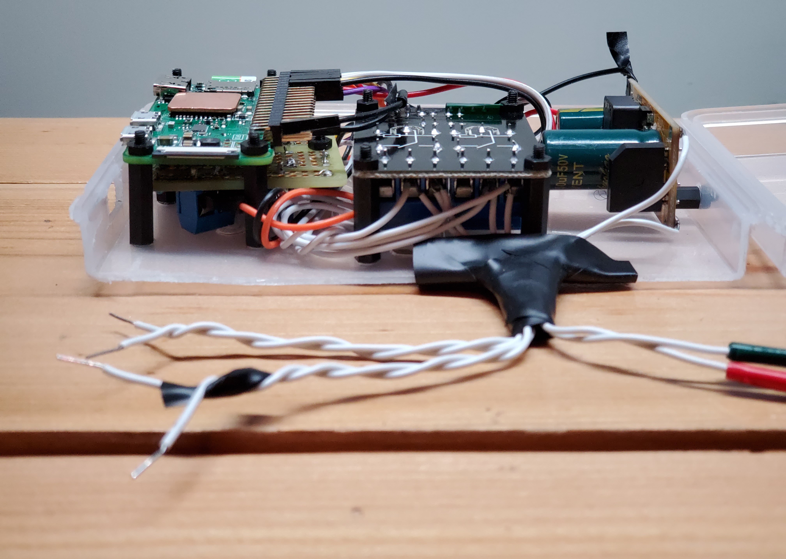

# RPI-Retrofit-Smart-Thermostat 
### (CCTA/ClimateControlThermostatApplication)
###### This project is a multi-tier extensible collection of applications meant to work on a [Raspberry Pi Zero W](https://www.raspberrypi.org/products/raspberry-pi-zero-w/) that controls an older non-smart thermostat. Any other pi would likely work just fine.

[](#)


## [Click for a Live Demo](https://5f84069fe6479b37533defb2--stoic-fermi-00dc16.netlify.app/)

While this isn't the first rpi thermostat, I haven't seen one quite like what I've made here. This project was designed with extensibility in mind, so **you can easily build any service to communicate with your thermostat**. The [API](https://app.swaggerhub.com/apis/geektechniquestudios/RpiThermostatCCTA/1.0.0#/Temperature/post_update_temperature) is exceedingly simple and easy to use. Two relays superficially control an older thermostat by simulating button presses.

[](https://5f84069fe6479b37533defb2--stoic-fermi-00dc16.netlify.app/)


[img of thermostat being used to update temp] @todo


## Installation Guide

 <details>
  <summary>
   Easy Setup
  </summary>
 <br>

Pasting this into a terminal on the pi will clone this repo into your "~/" directory, install all dependencies, and append the crontab for the root user to launch both the spring boot server and react server start on boot. 

```console
sudo bash -c 'apt update -y && apt upgrade -y && apt install redis-server openjdk-8-jre wiringpi nodejs npm git -y && npm i -g serve --save && cd ~ && git clone https://github.com/geektechniquestudios/RPI-Retrofit-Smart-Thermostat && cd /home/pi/RPI-Retrofit-Smart-Thermostat/CCTA-React-Client && npm run-script build && (crontab -l ; echo "@reboot java -jar /home/pi/RPI-Retrofit-Smart-Thermostat/ccta-1.0.0.jar\n@reboot sudo serve -l 80 -s /home/pi/RPI-Retrofit-Smart-Thermostat/CCTA-React-Client/build") | crontab -' 
```
	
 </details>

 <details>
  <summary>
   Advanced Setup (optional alternative)
  </summary>
 <br>
 
 In case you'd rather individually install your dependencies:
 
 
 Don't forget to ```sudo apt update``` first
 
  - a redis server running on the pi
  
      ```sudo apt install redis-server```
      
  - a java 1.8+ jre
      
      ```sudo apt install openjdk-8-jre```
      
  - node
  	  
     ```sudo apt install nodejs```
     
  - npm	  
  	  
     ```sudo apt install npm```
     
  - serve
  	  
     ```sudo npm i -g serve --save```
     
  - wiringpi
     
     ```sudo apt install wiringpi```

 You'll need to build the react project before serving it. You can do that by navigating into the ccta-react-client folder and running
 
 ```npm run-script build```

 If you'd like the pi to automatically start the spring boot and react servers on boot, you'll probably want to to add them to a crontab. You can do that by typing
 
  ```crontab -e```
 
 and appending the following lines to the end of the file
 
 ```console
 @reboot java -jar /home/pi/RPI-Retrofit-Smart-Thermostat/ccta-1.0.0.jar
 @reboot sudo serve -l 80 -s /home/pi/RPI-Retrofit-Smart-Thermostat/CCTA-React-Client/build
 ```
 
 </details> 

## How to Use This Software


[link to video to come]


As this is still a WIP, this system operates on the pretense that your LAN router ip address is 10.0.0.1 with the pi having the reserved address 10.0.0.6. Your LAN ip might be 192.168.1.1 or something else, so you may have to change the ip addresses in the code to get this working in your environment. The ease-of-setup will be drastically improved in future releases.

While figuring out what gpio pins to use to control the relay, reference the [pi4j wiring documentation](https://pi4j.com/1.2/pins/model-zerow-rev1.html). It may vary from board to board, so carefully ensure you have the correct wiring. Based on wiringpi's wiring and **not the pi's header numbering**, this code uses ```gpio pin 0``` for temperature down, and ```gpio pin 1``` for temperature up.

 [I mounted the box in the wall behind the thermostat]

Once you have everything installed, restart your pi. You should be able to access the pi over your lan by typing 10.0.0.6 into a web browser. As a convience you can change this to ```thermostat/``` if your router supports local dns; alternatively use [dnsmasq](https://help.ubuntu.com/community/Dnsmasq).

###### [API reference](https://app.swaggerhub.com/apis/geektechniquestudios/RpiThermostatCCTA/1.0.0#/Temperature/post_update_temperature)
###### *google home action integration soon to come*
