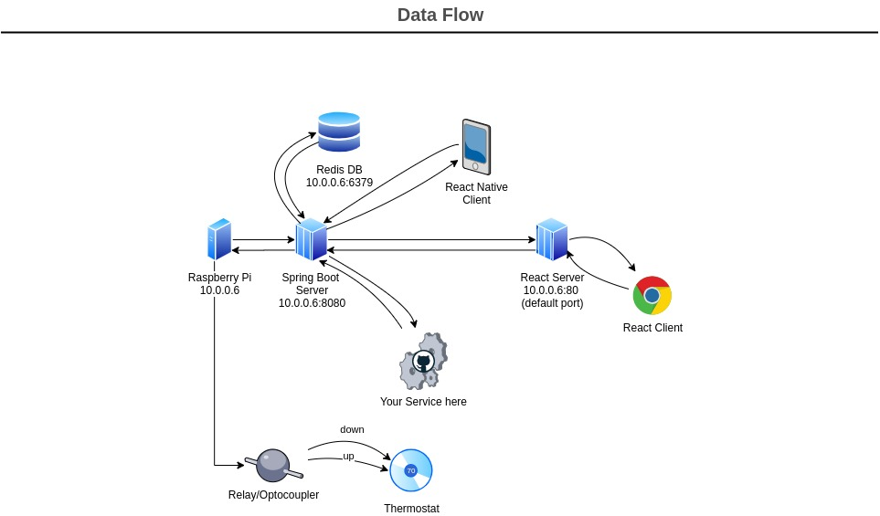

### Actively writing now

# RPI-Retrofit-Smart-Thermostat 
### (CCTA/ClimateControlThermostatApplication)

###### This multi-tier collection of applications is meant to work on a raspberry pi 0w, but any other pi would likely work just fine.

[gif of thermostat screenshot] @todo

[img of thermostat being used to update temp] @todo


## Installation guide

 <details>
  <summary>
   Easy Setup
  </summary>
 <br>

Pasting this into a terminal on the pi will clone this repo into your "~/" directory, install all dependencies, and append the crontab for the root user to launch both the spring boot server and react server start on boot. 

```console
sudo bash -c 'apt update -y && apt upgrade -y && apt install redis-server openjdk-8-jre wiringpi nodejs npm git -y && npm i -g serve --save && cd ~ && git clone https://github.com/geektechniquestudios/RPI-Retrofit-Smart-Thermostat && cd /home/pi/RPI-Retrofit-Smart-Thermostat/CCTA-React-Client && npm run-script build && (crontab -l ; echo "@reboot java -jar /home/pi/RPI-Retrofit-Smart-Thermostat/ccta-1.0.0.jar\n@reboot sudo serve -l 80 -s /home/pi/RPI-Retrofit-Smart-Thermostat/CCTA-React-Client/build") | crontab -' 
```
	
 </details>

 <details>
  <summary>
   Alternative Longer Setup 
  </summary>
 <br>
 
 If you'd rather do the installation more manually, you can run each command as it suits your needs
 
 
 Don't forget to ```sudo apt update``` first
 
  - a redis server running on the pi
  
      ```sudo apt install redis-server```
      
  - a java 1.8+ jre
      
      ```sudo apt install openjdk-8-jre```
      
  - node
  	  
     ```sudo apt install nodejs```
     
  - npm	  
  	  
     ```sudo apt install npm```
     
  - serve
  	  
     ```sudo npm i -g serve --save```
     
  - wiringpi
     
     ```sudo apt install wiringpi```

 You'll need to build the react project before serving it. You can do that by navigating into the ccta-react-client folder and running
 
 ```npm run-script build```

 If you'd like the pi to automatically start the spring boot and react servers on boot, you'll probably want to to add them to a crontab. You can do that by typing
 
  ```crontab -e```
 
 and appending the following lines to the end of the file
 
 ```console
 @reboot java -jar /home/pi/RPI-Retrofit-Smart-Thermostat/ccta-1.0.0.jar
 @reboot sudo serve -l 80 -s /home/pi/RPI-Retrofit-Smart-Thermostat/CCTA-React-Client/build
 ```
 
 </details> 




[link to video to come]

While there are already a couple of rpi thermostats out there, I haven't seen one quite like what I've made here. This project was designed with extensibility in mind, so *you can easily build any service to communicate with the thermostat*. The Rest API is exceedingly simple and easy to use. The interface is superficial in that it controls the older thermostat by simulating a button press.

As this is still a WIP, the code is based on my LAN subnet of(10.255.255.255) with my pi having the reserved address 10.0.0.6. Yours might be (192.168.255.255) or something else, so you may have to change the ip addresses I use in my code to get this working in your environment. The ease-of-setup will be drastically improved in future releases.
 


*google home action integration soon to come*
