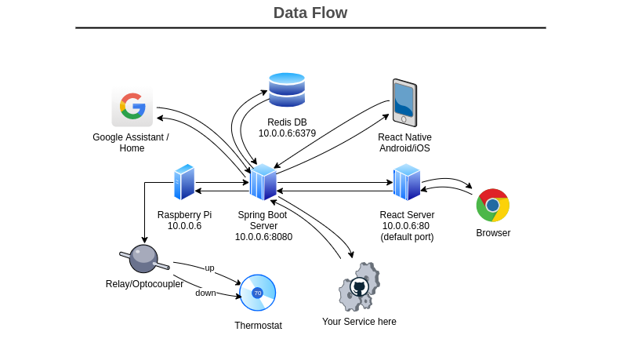
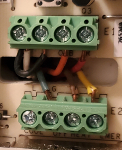

# RPI-Retrofit-Smart-Thermostat 
### (CCTA/ClimateControlThermostatApplication)
###### A multitier modular collection of software meant to work on a [Raspberry Pi Zero W](https://www.raspberrypi.org/products/raspberry-pi-zero-w/) to control an older non-smart thermostat. Any other pi would likely work just fine.

[](#)


While a raspberry pi thermostat isn't exactly novel, this particular project was designed with extensibility in mind, so **you can easily build any service to communicate with your thermostat**. The [API](https://app.swaggerhub.com/apis/geektechniquestudios/RpiThermostatCCTA/1.0.0#/Temperature/post_update_temperature) is exceedingly simple and easy to use. Two relays superficially control an older thermostat by simulating button presses.

[](https://5f84069fe6479b37533defb2--stoic-fermi-00dc16.netlify.app/)


---

## <h2 align="center"> [:thermometer:Click for a Live Demo:thermometer:](https://5f84069fe6479b37533defb2--stoic-fermi-00dc16.netlify.app/) </h2>

---


## Installation Guide

 <details>
  <summary>
   Easy Setup
  </summary>
 <br>

Pasting the snippet below into a terminal on the pi will clone this repo into your "~/" directory, install all dependencies, make a build folder for the react service, and append the crontab for the root user to launch both the spring boot server and react server start on boot. 

```console
sudo bash -c 'apt update -y && apt upgrade -y && apt install redis-server openjdk-8-jre wiringpi nodejs npm git -y && npm i -g npm@latest
 && npm i -g serve --save && cd ~ && git clone https://github.com/geektechniquestudios/RPI-Retrofit-Smart-Thermostat && cd /home/pi/RPI-Retrofit-Smart-Thermostat/CCTA-React-Client && npm i && npm run-script build && (crontab -l ; echo "@reboot java -jar /home/pi/RPI-Retrofit-Smart-Thermostat/ccta-1.0.0.jar\n@reboot sudo serve -l 80 -s /home/pi/RPI-Retrofit-Smart-Thermostat/CCTA-React-Client/build") | crontab -' 
```

If any of the steps in that terminal command fail, you'll want to delete the folder it made from cloning this repo. You can do that by typing `rm -r ~/RPI-Retrofit-Smart-Thermostat` on the pi. If you need to rerun the command after it **successfully** completes, you should check your crontab file by typing `crontab -e`. Ensure you don't have the same commands repeated from running the setup script. 
	
 </details>

 <details>
  <summary>
   Advanced Setup (optional alternative)
  </summary>
 <br>
 
 In case you'd prefer to individually install your dependencies, you'll need the following:
   ###### Don't forget to ```sudo apt update``` first
 
  - a redis server running on the pi
  
      ```sudo apt install redis-server```
      
  - a java 1.8+ jre
      
      ```sudo apt install openjdk-8-jre```
      
  - node
  	  
     ```sudo apt install nodejs```
     
  - npm	  
  	  
     ```sudo apt install npm```
     
     ```npm i -g npm@latest```
     
  - serve
  	  
     ```sudo npm i -g serve --save```
     
  - wiringpi
     
     ```sudo apt install wiringpi```

You'll need to build the react project before serving it. You can do that by navigating into the ccta-react-client folder and running
 
 ```npm i ```
 
 ```npm run-script build```

If you'd like the pi to automatically start the spring boot and react servers on boot, you'll probably want to add them to a crontab. You can do that by typing
 
  ```crontab -e```
 
 and appending the following lines to the end of the file
 
 ```console
 @reboot java -jar /home/pi/RPI-Retrofit-Smart-Thermostat/ccta-1.0.0.jar
 @reboot sudo serve -l 80 -s /home/pi/RPI-Retrofit-Smart-Thermostat/CCTA-React-Client/build
 ```
 
 </details> 

## How to Use This Software




As this is still a WIP, this system operates on the pretense that your pi has the reserved address `10.0.0.6`. Your LAN router IP might be `192.168.1.1` or something else. If you can't reserve `10.0.0.6` for your pi, you may have to change the IP addresses in code or change your local ip configuration to get this working in your environment. The ease-of-setup will be drastically improved in future releases.

While figuring out what GPIO pins to use to control the relay, reference the [pi4j wiring documentation](https://pi4j.com/1.2/pins/model-zerow-rev1.html). It may vary from board to board, so carefully ensure you have the correct wiring. Based on wiringpi's wiring and **not the pi's header numbering**, this code uses ```gpio pin 0``` for temperature down, and ```gpio pin 1``` for temperature up.

Once you have everything installed and your IP address reserved, restart your pi. You should be able to access the pi over your LAN by typing `10.0.0.6` into a web browser. As a convenience you can change this to ```thermostat/``` if your router supports local DNS; alternatively, use may consider [dnsmasq](https://help.ubuntu.com/community/Dnsmasq).


## How to Physically Install



 

AC units have a 24v AC wire (red | **R**) and a common ground (blue or black | **C**). You can get a transformer to power the pi for 5 or 10 dollars on Amazon. I bought [this one](https://www.amazon.com/gp/product/B00SO4T7IU/ref=ppx_yo_dt_b_asin_title_o08_s00?ie=UTF8&psc=1) because it has a potentiometer, allowing you to control the output voltage. Pis can be powered by connecting 5v DC power to the respective positive and negative rails of the board.


Fortunately, removing a bathroom mirror leads directly into the wall behind my thermostat. The pi changes the temperature by shorting the circuit that the button normally bridges when pressed.


## Notes About This Software

##### - There is a 10 second debounce buffer on the update temperature action if multiple requests are sent, otherwise there is a 3 second buffer. Any input you give the thermostat intentionally takes a moment to execute. You can change these values in the spring boot thermostat controller.

##### - The react native app is very simple and easy to modify. It is only about 80 lines of code and serves more as a proof of concept, whereas I use the reactjs web client on a daily basis. 

##### - The relays I used for this project are closed circuit by default. If you need or want to use relays that work in the opposite fashion, take a deep breath and rub your eyes. You can look in the Spring Boot Server and find the `TemperatureController.java` file in the src folder. Invert the values of the pin states on lines 19, 23, 121, 123, 132, and 134. To be extra clear, on the aforementioned lines, everywhere it says `PinState.LOW`, or `PinState.HIGH`, exchange one for the other. Rebuild the jar file with `mvn clean install` in the project directory. Then send the generated jar file to the pi directory `/home/pi/RPI-Retrofit-Smart-Thermostat/ccta-1.0.0.jar`, finally restart the pi. If this seems like a lot, send me a message and I'll do my best to help. If anyone asks me, I'll probably just build another jar file to make it easier. HMU, or I won't know I need to get on this, although I will eventually get to it.


##### [Swagger API reference](https://app.swaggerhub.com/apis/geektechniquestudios/RpiThermostatCCTA/1.0.0#/Temperature/post_update_temperature)

##### *Todo/Wishlist*
   ###### &nbsp;&nbsp;&nbsp;&nbsp;&nbsp;&nbsp; google home integration
   ###### &nbsp;&nbsp;&nbsp;&nbsp;&nbsp;&nbsp; scheduling
   ###### &nbsp;&nbsp;&nbsp;&nbsp;&nbsp;&nbsp; an options menu in the reactjs service
   ###### &nbsp;&nbsp;&nbsp;&nbsp;&nbsp;&nbsp; docker-compose
   
Thanks for checking out my work. I really appreciate any engagement!
